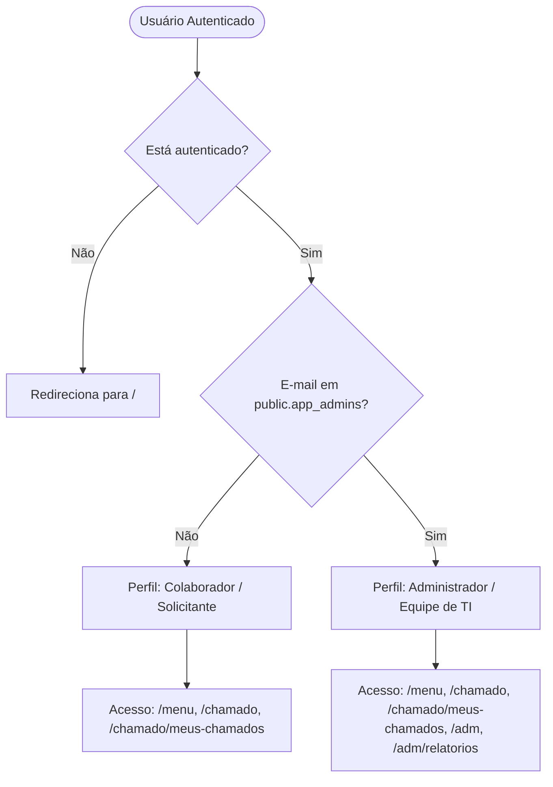
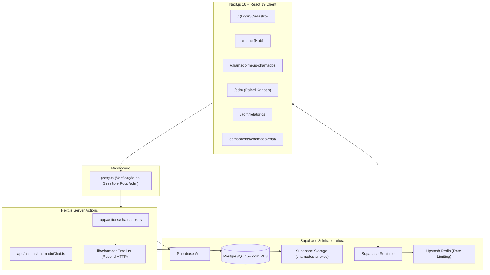
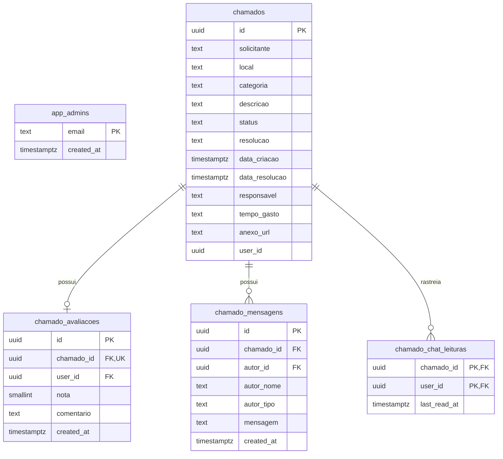

# Documentação Técnica e Funcional do Maple Help

Este documento é a referência técnica e funcional completa para o desenvolvimento, manutenção, infraestrutura e operação do **Maple Help**.

---

## 1. Visão Geral

O **Maple Help** é uma plataforma web corporativa de help desk desenvolvida especificamente para a **Maple Bear Araxá**. O sistema centraliza, organiza e audita todos os chamados de suporte técnico de Tecnologia da Informação (TI) da instituição, permitindo que colaboradores abram chamados, conversem em tempo real com os técnicos, acompanhem soluções e avaliem o atendimento prestado.

---

## 2. Objetivos do Sistema

- **Centralização do Atendimento**: Eliminar solicitações dispersas e não rastreáveis.
- **Rastreabilidade e SLA**: Registrar data/hora de abertura, aceite, finalização, tempo gasto e solução técnica de cada incidente.
- **Comunicação Direta**: Fornecer chat individual e em tempo real dentro do próprio chamado, eliminando ruídos de comunicação.
- **Métricas e Governança**: Gerar relatórios automatizados, gráficos de sazonalidade/categoria e planilhas formatadas para a liderança.
- **Segurança Institucional**: Garantir que apenas usuários com contas autenticadas `@maplebeararaxa.com.br` acessem o sistema e que cada usuário veja estritamente seus próprios dados.

---

## 3. Escopo da Versão Atual

### ✅ Funcionalidades Implementadas
- Autenticação com e-mail corporativo (`@maplebeararaxa.com.br`) via Supabase Auth (Login, Cadastro e Recuperação de Senha).
- Validação do domínio corporativo no frontend e na camada de banco de dados via triggers.
- Abertura de chamados de TI com anexo opcional de imagem (JPEG, PNG ou WEBP até 5 MB).
- Acompanhamento dos próprios chamados com histórico, status e detalhes da resolução técnica.
- **Chat interno individual por chamado**:
  - Conversa bidirecional em tempo real entre o solicitante e a equipe de TI.
  - Disponível dentro do card em *Meus Chamados* e no modal de atendimento administrativo.
  - Badges com contagem de mensagens não lidas e atualização em tempo real via Supabase Realtime.
  - Bloqueio mútuo automático de novas mensagens após o chamado ser concluído, mantendo histórico disponível.
  - Paginação por cursor composto `(created_at, id)`.
- Painel administrativo Kanban em tempo real para triagem (*Pendentes*, *Em Andamento*, *Concluídos no Dia*).
- Ações da equipe de TI: assumir chamado, concluir (com preenchimento obrigatório de solução e tempo) e excluir.
- Avaliação do chamado concluído: nota de 1 a 5 estrelas e comentário opcional até 500 caracteres.
- Notificações opcionais por e-mail via Resend ao assumir e concluir chamados (com link para avaliação).
- Relatórios mensais com indicadores, gráficos na tela e exportação completa para Excel (`.xlsx`) com gráficos SVG convertidos embutidos.
- Limitação de taxa de requisições (Rate Limit) para chamados (por IP) e chat (por usuário) via Upstash Redis.

### ❌ Fora do Escopo Atual
- Módulo **Manutenção Estrutural** (apresentado no menu apenas como indicação de expansão futura).
- Notificações ou integrações com WhatsApp (o sistema não utiliza, não integra e não planeja envio de WhatsApp).
- Notificações externas por e-mail para o chat (o chat opera exclusivamente com badges e notificações in-app).
- Upload de arquivos de áudio, vídeos, documentos PDF ou reações no chat.
- Aplicativo móvel nativo (o sistema é uma aplicação web responsiva).

---

## 4. Perfis de Usuário e Autorização

### Fonte Única da Verdade (`public.app_admins`)
A autorização administrativa é gerida no banco de dados na tabela `public.app_admins`.
A função SQL `public.is_admin()` (`SECURITY INVOKER`, `SET search_path = public, pg_temp`) verifica se o e-mail do JWT (`auth.jwt() ->> 'email'`) existe nessa tabela.

> ℹ️ **Fallback Transitório (`ADMIN_EMAILS`):**
> Caso a tabela `public.app_admins` não exista (código de erro PostgreSQL `42P01`), a aplicação utiliza temporariamente a variável de ambiente `ADMIN_EMAILS`. Esta contingência existe apenas para proteção transitória e nunca deve ser considerada a fonte primária.



### 1. Perfil Colaborador (Solicitante)
- Utiliza e-mail corporativo `@maplebeararaxa.com.br`.
- Pode abrir chamados de TI vinculados ao seu próprio `user_id`.
- Consulta unicamente os chamados abertos por si mesmo.
- Envia mensagens no chat de seus próprios chamados enquanto estiverem `Pendente` ou `Em Andamento`.
- Avalia o chamado uma única vez após a conclusão.

### 2. Perfil Administrador (Equipe de TI)
- E-mail cadastrado na tabela `public.app_admins`.
- Acessa as rotas protegidas `/adm` e `/adm/relatorios`.
- Visualiza todos os chamados da instituição em tempo real.
- Assume chamados pendentes (tornando-se o responsável).
- Finaliza chamados em andamento informando resolução técnica e tempo gasto.
- Envia mensagens nos chats de qualquer chamado aberto, identificado como "Equipe de TI".
- Exclui chamados quando necessário.
- Visualiza métricas analíticas e exporta relatórios completos para Excel.

---

## 5. Fluxos de Ponta a Ponta

### 5.1. Fluxo de Autenticação e Acesso
1. Usuário acessa `/`.
2. O sistema valida se o e-mail informado termina com `@maplebeararaxa.com.br`.
3. O Supabase Auth autentica as credenciais e emite tokens de sessão (JWT) armazenados em cookies seguros.
4. O usuário é redirecionado para `/menu`.
5. No menu, o botão para o *Painel Administrativo* é exibido apenas se o usuário pertencer a `public.app_admins`.

### 5.2. Fluxo de Abertura de Chamado
1. Colaborador clica em "Abrir Chamado" (`/chamado`).
2. Preenche os campos: Solicitante (nome), Local (sala/bloco), Categoria e Descrição detalhada.
3. Opcionalmente, anexa uma foto do problema (JPEG, PNG ou WEBP até 5 MB).
4. O cliente faz o upload direto para o bucket `chamados-anexos` no Supabase Storage.
5. A Server Action `abrirChamado` (`app/actions/chamados.ts`) valida os dados com Zod e grava o registro na tabela `chamados` com status `Pendente` e `user_id = auth.uid()`.
6. Se a gravação do chamado falhar após o upload da imagem, a Server Action efetua a limpeza do arquivo no bucket.
7. O painel administrativo da TI recebe a inserção em tempo real via Supabase Realtime.

### 5.3. Fluxo de Atendimento da TI
1. A equipe de TI visualiza o novo chamado na coluna *Pendentes* de `/adm`.
2. Um técnico clica em "Aceitar Chamado" / "Assumir Chamado":
   - O status é atualizado para `Em Andamento`.
   - O campo `responsavel` recebe o nome do técnico.
   - O sistema tenta enviar um e-mail transacional de notificação ao solicitante (caso configurado).
3. O chamado move-se para a coluna *Em Andamento*.

### 5.4. Fluxo do Chat Interno por Chamado
1. O solicitante abre o chamado em `/chamado/meus-chamados` ou o técnico clica na aba "Conversa" em `/adm`.
2. O componente `ChamadoChat` carrega as últimas mensagens via `obterMensagensDoChamado` e subscreve o canal Realtime da tabela `chamado_mensagens`.
3. Ao enviar uma mensagem:
   - A interface executa envio otimista imediato.
   - A Server Action `enviarMensagemDoChamado` valida a mensagem (1 a 2.000 caracteres) e o status do chamado.
   - O trigger de banco `trg_chamado_mensagens_identidade` garante a integridade de `autor_id`, `autor_tipo` e `autor_nome`.
   - A leitura do autor é atualizada automaticamente em `chamado_chat_leituras`.
4. O outro participante recebe a mensagem instantaneamente via Realtime. Caso a conversa esteja fechada, um badge de não lidas é incrementado.

### 5.5. Fluxo de Finalização e Avaliação
1. Com o chamado `Em Andamento`, o técnico clica em "Finalizar Chamado".
2. Informa obrigatoriamente a descrição da **Resolução** (mínimo de 5 caracteres) e o **Tempo Gasto** (ex.: "30m", "1h 15m").
3. O status muda para `Concluído`, registrando `data_resolucao = now()`.
4. O chat é bloqueado para novas mensagens para ambas as partes.
5. Um e-mail transacional opcional é enviado com a resolução e o link para avaliação.
6. O solicitante acessa `/chamado/meus-chamados`, visualiza a solução e preenche a avaliação (1 a 5 estrelas e comentário opcional).

---

## 6. Regras de Negócio

1. **Domínio Obrigatório**: Somente e-mails terminados em `@maplebeararaxa.com.br` são aceitos.
2. **Validação em Camadas**: A validação do domínio ocorre no formulário, nas Server Actions e no PostgreSQL via triggers `BEFORE INSERT` em `auth.users`.
3. **Status Inicial**: Todo chamado é criado obrigatoriamente com o status `Pendente`.
4. **Restrição para Assumir**: Somente administradores podem assumir chamados, e apenas chamados com status `Pendente`.
5. **Transição para Em Andamento**: Ao assumir, o status muda para `Em Andamento`, registra o técnico responsável e aciona a notificação de e-mail opcional.
6. **Restrição de Conclusão**: Um chamado só pode ser concluído se estiver no status `Em Andamento`.
7. **Campos Obrigatórios na Conclusão**: Finalizar exige texto de resolução, tempo gasto e atualiza `data_resolucao`.
8. **Resiliência de E-mail**: Falhas no envio de e-mails transacionais (Resend) nunca cancelam nem revertem a alteração de status do chamado.
9. **Isolamento de Dados do Solicitante**: Usuários comuns têm permissão de leitura restrita unicamente aos chamados criados por seu próprio `user_id`.
10. **Acesso da TI**: Administradores autenticados têm permissão de leitura e edição sobre todos os chamados da base.
11. **Escopo do Chat**: Toda mensagem pertence obrigatoriamente a um único `chamado_id`.
12. **Isolamento do Chat**: Usuários comuns só podem ler ou enviar mensagens em chats de chamados cujo `user_id` seja o seu próprio.
13. **Acesso Administrativo ao Chat**: Administradores podem visualizar e interagir em todos os chats da base.
14. **Tamanho das Mensagens**: Mensagens do chat aceitam entre 1 e 2.000 caracteres (após remoção de espaços nas extremidades).
15. **Tamanho de Página do Chat**: A listagem inicial do chat carrega 50 mensagens por padrão.
16. **Paginação do Chat**: Utiliza cursor composto decrescente baseado em `(created_at, id)`.
17. **Sincronização Realtime**: Inserções em `chamado_mensagens` disparam eventos Realtime para todos os clientes conectados ao canal do chamado.
18. **Envio Otimista**: Mensagens aparecem imediatamente na interface do remetente com indicador visual de envio e reconciliação automática.
19. **Reenvio de Mensagens**: Mensagens que falharem no envio exibem botão de repetição.
20. **Rastreio de Leitura**: O registro de visualização de mensagens é gravado em `public.chamado_chat_leituras` (`last_read_at`).
21. **Cálculo de Não Lidas (TI)**: Para a TI, mensagens não lidas são aquelas com `autor_tipo = 'usuario'` enviadas após o `last_read_at` do administrador.
22. **Cálculo de Não Lidas (Solicitante)**: Para o solicitante, mensagens não lidas são aquelas com `autor_tipo = 'ti'` enviadas após seu `last_read_at`.
23. **Bloqueio do Chat pós-Conclusão**: Assim que o chamado passa para `Concluído`, o envio de novas mensagens é bloqueado no frontend e no banco (RLS) para ambas as partes.
24. **Preservação de Histórico**: O encerramento do chamado mantém o histórico completo das mensagens acessível para consulta.
25. **Unicidade de Avaliação**: Cada chamado concluído aceita rigorosamente uma única avaliação (`UNIQUE (chamado_id)`).
26. **Escala da Avaliação**: A nota deve ser um valor inteiro entre 1 e 5.
27. **Comentário de Avaliação**: O comentário é opcional e limitado a 500 caracteres.
28. **Formatos de Anexo**: Formatos aceitos: `image/jpeg`, `image/png` e `image/webp`. Tamanho máximo: 5 MB.
29. **Categorias Oficiais de TI**:
    - `Wi-fi | Cabeamento`
    - `Computador | Notebook`
    - `Televisão | Som`
    - `Ajuda | Duvidas`
    - `Outros`
30. **Limites de Tamanho da Descrição**:
    - No servidor (Zod): mínimo de 10 caracteres, máximo de 1.000 caracteres.
    - Na interface (`ChamadoForm.tsx`): limitada atualmente a 500 caracteres (limite efetivo de tela). Devem ser mantidos alinhados em manutenções.
31. **Rate Limit de Chamados**: Limite de 5 chamados a cada 10 minutos por endereço IP.
32. **Rate Limit de Chat**: Limite de 20 mensagens a cada 1 minuto por usuário autenticado.

---

## 7. Estrutura de Rotas da Aplicação

| Rota | Acesso | Descrição |
| --- | --- | --- |
| `/` | Público | Portal de autenticação: Login, Cadastro e Recuperação de Senha |
| `/menu` | Autenticado | Hub central com atalhos para abertura, Meus Chamados e Administração |
| `/chamado` | Autenticado | Formulário de abertura de novo chamado com upload de anexo |
| `/chamado/meus-chamados` | Autenticado | Lista dos chamados do usuário, chat em tempo real e avaliação |
| `/adm` | Administrador | Painel Kanban em tempo real para atendimento e gestão da fila |
| `/adm/relatorios` | Administrador | Dashboard de métricas, gráficos interativos e exportação para Excel |

---

## 8. Arquitetura do Software



---

## 9. Tecnologias e Dependências

| Pacote | Versão | Função no Projeto |
| --- | --- | --- |
| `next` | `16.2.10` | Framework full-stack com App Router e Server Actions |
| `react` / `react-dom` | `19.2.4` | Biblioteca de componentes de interface declarativa |
| `typescript` | `^5` | Tipagem estática rigorosa para todo o código |
| `tailwindcss` / `@tailwindcss/postcss` | `^4` | Framework CSS utilitário para design responsivo |
| `@supabase/ssr` | `^0.12.4` | Cliente Supabase para Server Components, Server Actions e Middleware |
| `@supabase/supabase-js` | `^2.110.7` | SDK do Supabase para banco, autenticação, storage e realtime |
| `@upstash/ratelimit` | `^2.0.8` | Algoritmo de Sliding Window para limitação de requisições |
| `@upstash/redis` | `^1.38.2` | Cliente HTTP/REST para Redis serverless |
| `exceljs` | `^4.4.0` | Criação e estilização de planilhas Excel avançadas |
| `file-saver` | `^2.0.5` | Disparo de download de arquivos binários no navegador |
| `recharts` | `^3.10.1` | Renderização de gráficos interativos na página de relatórios |
| `zod` | `^4.4.3` | Validação de esquemas e dados nas Server Actions |
| `vitest` | `^4.1.10` | Framework de testes unitários e de integração de alta performance |

---

## 10. Server Actions (Regras de Servidor)

### `app/actions/chamados.ts`
- `abrirChamado(dados)`: Valida os dados de entrada com Zod, verifica o rate limit por IP, associa o `user_id` do usuário logado e insere o registro com status `Pendente`.
- `obterMeusChamados()`: Retorna os chamados pertencentes ao usuário autenticado, gerando URLs públicas para anexos.
- `obterChamadosAdm()`: Exclusiva para administradores. Retorna todos os chamados pendentes, em andamento e concluídos nas últimas 24 horas.
- `assumirChamado(id)`: Exclusiva para administradores. Atualiza status para `Em Andamento`, define o responsável e dispara e-mail de notificação.
- `finalizarChamado(id, resolucao, tempo_gasto)`: Exclusiva para administradores. Valida resolução e tempo, atualiza status para `Concluído`, define `data_resolucao` e dispara e-mail de conclusão com link de avaliação.
- `excluirChamado(id)`: Exclusiva para administradores. Remove o registro do chamado (e anexos/mensagens associadas em cascata).
- `registrarAvaliacao(chamadoId, nota, comentario)`: Permite ao solicitante avaliar seu próprio chamado concluído.
- `obterRelatorioCompleto(mes, ano)`: Exclusiva para administradores. Realiza paginação automática em blocos de até 1.000 registros para obter todos os chamados concluídos do mês para exportação.
- `obterEstatisticasMensais(mes, ano)`: Exclusiva para administradores. Retorna contagem de chamados, tempo médio de atendimento e dados de agregação.

### `app/actions/chamadoChat.ts`
- `obterMensagensDoChamado(chamadoId, limit, cursor)`: Valida permissão de acesso ao chamado e retorna lote de mensagens com cursor composto decrescente.
- `enviarMensagemDoChamado(chamadoId, mensagem)`: Valida permissão, rate limit do chat por usuário (20/min), status do chamado e insere mensagem.
- `marcarChatComoLido(chamadoId)`: Realiza `UPSERT` atômico na tabela `chamado_chat_leituras` atualizando `last_read_at = now()`.
- `obterContadoresNaoLidos(chamadoIds)`: Retorna mapa com total de mensagens não lidas para cada chamado solicitado.

---

## 11. Banco de Dados e Modelagem Relacional



### Detalhamento das Tabelas

#### 1. `public.app_admins`
- `email` (text, PK): E-mail do administrador em letras minúsculas (`check (email = lower(trim(email)))`).
- `created_at` (timestamptz): Data de concessão do privilégio administrativo.

#### 2. `public.chamados`
- `id` (uuid, PK): Identificador único gerado por `gen_random_uuid()`.
- `solicitante` (text): Nome do colaborador solicitante.
- `local` (text): Localização do incidente (sala, bloco, laboratório).
- `categoria` (text): Categoria de atendimento.
- `descricao` (text): Detalhamento do problema.
- `status` (text): `Pendente`, `Em Andamento` ou `Concluído`. Default `'Pendente'`.
- `resolucao` (text, opcional): Solução técnica registrada pela TI.
- `data_criacao` (timestamptz): Timestamp de abertura (`timezone('utc', now())`).
- `data_resolucao` (timestamptz, opcional): Timestamp de encerramento.
- `responsavel` (text, opcional): Nome do técnico de TI que assumiu.
- `tempo_gasto` (text, opcional): Tempo despendido (ex.: "45m", "2h").
- `anexo_url` (text, opcional): Caminho relativo da imagem no bucket.
- `user_id` (uuid, default `auth.uid()`): Identificador do usuário que abriu o chamado.
  *(Nota: No esquema atual, não há constraint de chave estrangeira explícita para `auth.users`, mas o campo armazena o UID autenticado).*

#### 3. `public.chamado_avaliacoes`
- `id` (uuid, PK): Identificador único da avaliação.
- `chamado_id` (uuid, FK `chamados.id` `ON DELETE CASCADE`, UNIQUE): Um chamado aceita estritamente uma avaliação.
- `user_id` (uuid, FK `auth.users.id` `ON DELETE CASCADE`): Solicitante que avaliou.
- `nota` (smallint, `CHECK (nota >= 1 AND nota <= 5)`): Classificação de 1 a 5 estrelas.
- `comentario` (text, opcional, `CHECK (char_length(comentario) <= 500)`): Opinião do colaborador.
- `created_at` (timestamptz): Data/hora do envio.

#### 4. `public.chamado_mensagens`
- `id` (uuid, PK): Identificador da mensagem.
- `chamado_id` (uuid, FK `chamados.id` `ON DELETE CASCADE`): Referência ao chamado.
- `autor_id` (uuid, FK `auth.users.id` `ON DELETE SET NULL`): Autor autenticado da mensagem.
- `autor_nome` (text): Nome do autor preservado no registro.
- `autor_tipo` (text, `CHECK (autor_tipo IN ('usuario', 'ti'))`): Identificador do tipo de autor.
- `mensagem` (text, `CHECK (char_length(trim(mensagem)) BETWEEN 1 AND 2000)`): Conteúdo textual.
- `created_at` (timestamptz): Data/hora de gravação.
- *Índice composto*: `idx_chamado_mensagens_cursor (chamado_id, created_at ASC, id ASC)`.

#### 5. `public.chamado_chat_leituras`
- `chamado_id` (uuid, FK `chamados.id` `ON DELETE CASCADE`, PK composta).
- `user_id` (uuid, FK `auth.users.id` `ON DELETE CASCADE`, PK composta).
- `last_read_at` (timestamptz): Timestamp da última visualização.
- *Índice*: `idx_chamado_chat_leituras_user_chamado (user_id, chamado_id)`.

---

## 12. Políticas de Segurança (Row Level Security - RLS)

O RLS está habilitado em todas as tabelas do sistema:

### `public.app_admins`
- `app_admins_select_own`: Usuários autenticados podem consultar apenas o seu próprio registro (`email = lower(coalesce(auth.jwt() ->> 'email', ''))`). Inserções e remoções são restritas à `service_role` ou superusuários.

### `public.chamados`
- `chamados_select`: Solicitante visualiza seus próprios chamados (`user_id = auth.uid()`) e administradores visualizam todos (`public.is_admin()`).
- `chamados_insert`: Usuários autenticados podem inserir vinculando ao seu `user_id = auth.uid()` ou administradores.
- `chamados_update`: Exclusivo para administradores (`public.is_admin()`).
- `chamados_delete`: Exclusivo para administradores (`public.is_admin()`).

### `public.chamado_mensagens`
- `chamado_mensagens_select`: Administradores têm acesso a todas as mensagens; solicitantes apenas às mensagens de chamados onde `user_id = auth.uid()`.
- `chamado_mensagens_insert`: Restrito a chamados nos status `Pendente` ou `Em Andamento`, com `autor_id = auth.uid()`.

### `public.chamado_chat_leituras`
- `chamado_chat_leituras_select`: Usuário consulta apenas seus próprios registros de leitura (`user_id = auth.uid()`).
- `chamado_chat_leituras_insert` / `update`: Usuário atualiza seu próprio registro de leitura em chamados que possui permissão de acesso.

### `public.chamado_avaliacoes`
- `Solicitante le a propria avaliacao`: `user_id = auth.uid()`.
- `Solicitante avalia chamado concluido proprio`: Permite inserção apenas se `user_id = auth.uid()`, o chamado pertencer ao usuário e estiver com status `Concluído`.

---

## 13. Supabase Storage

- **Bucket**: `chamados-anexos` (configurado como público para visualização direta via URL).
- **Tipos Permitidos**: Imagens (`image/jpeg`, `image/png`, `image/webp`).
- **Tamanho Máximo**: 5 MB por arquivo.
- **Convenção de Nomes**: `{user_id}/{timestamp}_{random_hash}.{ext}`.
- **Política de Inserção**: Usuários autenticados têm permissão de upload no bucket `chamados-anexos`.

---

## 14. Supabase Realtime

As seguintes tabelas integram a publicação `supabase_realtime`:
1. `public.chamados`: Dispara atualizações de inserção, alteração de status e exclusão para sincronizar os cards no painel Kanban da TI (`/adm`) e em *Meus Chamados*.
2. `public.chamado_mensagens`: Dispara eventos de novas mensagens para alimentar o chat aberto instantaneamente e atualizar os badges de não lidas.

---

## 15. Chat Interno por Chamado

- **Identidade Protegida**: O trigger de banco `trg_chamado_mensagens_identidade` ignora o que for enviado no payload do cliente para autor e define no banco:
  - Se `public.is_admin()` for verdadeiro: `autor_tipo = 'ti'` e `autor_nome = 'Equipe de TI'`.
  - Caso contrário: `autor_tipo = 'usuario'` e `autor_nome` extraído do campo `solicitante` do chamado.
- **Bloqueio de Encerramento**: Quando o chamado é marcado como `Concluído`, a política de `INSERT` do RLS rejeita qualquer nova mensagem e o componente de interface bloqueia o input de texto com aviso explícito.
- **Navegação de Histórico**: Paginação com cursor bidirecional para rolagem suave sem recarregamento ou saltos indesejados.

---

## 16. Sistema de Avaliação do Atendimento

- Disponibilizado no card do chamado em `/chamado/meus-chamados` imediatamente após a conclusão.
- Permite selecionar de 1 a 5 estrelas e adicionar um comentário opcional.
- A Server Action `registrarAvaliacao` e a constraint `UNIQUE (chamado_id)` impedem avaliações duplicadas.

---

## 17. Relatórios e Indicadores Mensais

Disponíveis em `/adm/relatorios`:
- **Seletor de Período**: Filtro por Mês e Ano.
- **Cartões de Métricas**:
  - Total de Chamados Concluídos no mês.
  - Categoria com Maior Volume.
  - Tempo Médio de Resolução.
- **Gráficos em Tela (Recharts)**:
  - Distribuição percentual por Categoria (Gráfico de Pizza).
  - Volume de chamados abertos por dia útil do mês (Gráfico de Barras).
- **Tabela Paginada**: Listagem dos atendimentos com busca rápida e ordenação.

---

## 18. Exportação para Excel (`.xlsx`)

A exportação é processada via `ExcelJS` e `FileSaver`:
- **Busca Integral**: A função `obterRelatorioCompleto` realiza consultas paginadas em lotes de 1.000 registros para garantir a exportação de 100% dos dados do mês, independentemente da página visualizada na interface.
- **Diferença de Critérios de Filtro**:
  - A lista detalhada de chamados concluídos é filtrada pela data de encerramento (`data_resolucao`).
  - Os gráficos de pizza e de dias úteis consideram os chamados criados no período (`data_criacao`).
  - O gráfico de dias úteis inclui todos os dias de segunda a sexta-feira do mês (inclusive aqueles com volume zero) e exclui sábados e domingos.
- **Estrutura da Planilha Gerada**:
  - **Aba "Resumo"**: Métricas consolidadas e imagens vetoriais (SVG convertidas para PNG) dos gráficos de Categoria e Dias Úteis embutidas na planilha.
  - **Aba "Dados Completos"**: Tabela com cabeçalhos estilizados contendo Número, Solicitante, Local, Categoria, Descrição, Solução, Tempo Gasto, Técnico Responsável, Data de Abertura e Data de Conclusão.

---

## 19. E-mails e Notificações Transacionais

O envio de e-mails é implementado em `lib/chamadoEmail.ts` utilizando a API HTTP da **Resend**:
- **Eventos Notificados**:
  1. *Chamado Assumido*: Informa ao solicitante que a TI iniciou o atendimento e identifica o técnico responsável.
  2. *Chamado Concluído*: Informa ao solicitante a solução registrada e fornece link direto para avaliação do atendimento.
- **Isolamento Total do Chat**: O chat **nunca** dispara e-mails, SMS ou notificações externas.
- **Idempotência e Segurança**: As requisições HTTP para a Resend utilizam o cabeçalho `Idempotency-Key: maple-help-{chamado_id}-{evento}` e todos os dados dinâmicos do chamado são escapados contra injeção de HTML.
- **Comportamento Resiliente**: Se as variáveis da Resend não estiverem configuradas ou o envio falhar, o sistema registra um aviso no log do servidor e conclui a operação do chamado normalmente.

---

## 20. Rate Limiting e Proteção Contra Abuso

- **Produção**: Utiliza `@upstash/ratelimit` com backend Redis serverless (`@upstash/redis`) com algoritmo de janela deslizante (*Sliding Window*).
- **Desenvolvimento Local**: Possui fallback em memória que opera de forma transparente caso as credenciais do Upstash não estejam configuradas.
- **Regras de Limitação**:
  - **Abertura de Chamados**: 5 chamados a cada 10 minutos por IP.
  - **Mensagens do Chat**: 20 mensagens a cada 1 minuto por usuário autenticado.

---

## 21. Variáveis de Ambiente

| Variável | Tipo | Obrigatoriedade | Descrição e Uso |
| --- | --- | --- | --- |
| `NEXT_PUBLIC_SUPABASE_URL` | String (URL) | **Obrigatória** | URL do projeto Supabase corporativo |
| `NEXT_PUBLIC_SUPABASE_ANON_KEY` | String (JWT) | **Obrigatória** | Chave anônima pública do Supabase |
| `ADMIN_EMAILS` | String (Lista) | *Opcional* | Fallback temporário de e-mails caso a tabela `app_admins` retorne erro 42P01 |
| `UPSTASH_REDIS_REST_URL` | String (URL) | *Recomendada* | URL REST do cluster Upstash Redis |
| `UPSTASH_REDIS_REST_TOKEN` | String (Token) | *Recomendada* | Token de autenticação REST do Upstash Redis |
| `SUPABASE_SERVICE_ROLE_KEY` | String (JWT) | *Opcional* | Chave privada/secreta para buscar e-mails de usuários no Auth para notificações |
| `RESEND_API_KEY` | String | *Opcional* | Chave de API da Resend para e-mails transacionais |
| `RESEND_EMAIL_DOMAIN` | String | *Opcional* | Domínio configurado e verificado na Resend |
| `RESEND_FROM_EMAIL` | String | *Opcional* | Endereço completo do remetente (ex.: `Maple Help <chamados@dominio.com.br>`) |
| `APP_URL` | String (URL) | *Opcional* | URL base da aplicação para links nos e-mails |
| `NEXT_PUBLIC_APP_URL` | String (URL) | *Opcional* | Fallback secundário para `APP_URL` |
| `VERCEL_PROJECT_PRODUCTION_URL` | String (URL) | *Automática* | Fallback automático fornecido pela Vercel em builds de produção |

> 🔒 **Regra de Ouro:** A `SUPABASE_SERVICE_ROLE_KEY` e a `RESEND_API_KEY` são segredos de servidor. Elas nunca devem possuir o prefixo `NEXT_PUBLIC_` nem ser importadas em código cliente.

---

## 22. Guia de Configuração e Execução Local

1. **Instalação das dependências**:
   ```bash
   npm ci
   ```
2. **Criação do arquivo `.env.local`**:
   Preencha as variáveis mínimas necessárias para conexão com o Supabase.
3. **Execução do servidor local**:
   ```bash
   npm run dev
   ```
4. **Validação e Testes**:
   ```bash
   npm run lint
   npx tsc --noEmit
   npm run test
   ```

---

## 23. Estrutura do Supabase e Gerenciamento de Esquema

- O arquivo `supabase/maple_help_schema.sql` consolida toda a estrutura de tabelas, índices, triggers, funções e políticas de RLS para **instanciação de novos bancos**.
- **Atenção Crítica**: Não reaplique o arquivo consolidado na íntegra sobre um banco que já possua dados e estruturas criadas. O comando `alter publication supabase_realtime add table ...` gerará erro caso a tabela já pertença à publicação.
- Para alterações em ambientes existentes, sempre crie scripts de migração incrementais pontuais.

---

## 24. Deploy na Vercel

1. Conecte o repositório GitHub (`https://github.com/mb-araxa/Maple-Help.git`) ao projeto Vercel correspondente.
2. Configure o Framework Preset como **Next.js**.
3. Configure o comando de instalação como `npm ci` e o comando de build como `npm run build`.
4. Cadastre todas as variáveis de ambiente necessárias nas configurações da Vercel (*Settings > Environment Variables*) para os ambientes *Production*, *Preview* e *Development*.
5. Certifique-se de que o projeto Vercel aponte para o Supabase correto (`Maple Help-arx` / `pggzxierizlypanjvlyg`).
6. Dispare o deploy e valide o checklist funcional completo em produção.

---

## 25. Testes e Garantia de Qualidade

A suíte de testes do projeto é composta por:
- `__tests__/chamados.test.ts`: Testes unitários das validações Zod e regras de negócio de abertura, alteração de status e avaliações.
- `__tests__/chamadoChat.test.tsx`: Testes de componentes do chat, renderização de mensagens, acessibilidade de teclado e comportamento de envio.
- `__tests__/reportCharts.test.ts`: Testes das funções de agregação de categorias, contagem por dia útil e geração de SVGs.
- `supabase/tests/chamado_chat_rls.test.sql`: Teste SQL transacional com pgTAP validando isolamento de RLS entre usuários e administradores no banco.

---

## 26. Diretrizes de Segurança

1. **Defesa em Profundidade**: A autorização é checada na interface (ocultando componentes), no middleware `proxy.ts`, nas Server Actions via `supabase.auth.getUser()` e, fundamentalmente, nas políticas de RLS do PostgreSQL.
2. **Funções SQL Seguras**: As funções de trigger e de autorização utilizam `SECURITY INVOKER`, `search_path = ''` (ou `search_path = public, pg_temp`) e têm execução restrita a `authenticated`, `service_role` ou `supabase_auth_admin`.
3. **Leaked Password Protection**: O aviso no Security Advisor do Supabase está classificado como limitação técnica do plano Free (recurso exclusivo do Supabase Pro). Nenhuma contratação deve ser feita sem autorização formal da instituição.

---

## 27. Manutenção do Sistema

### 27.1. Adicionar um Novo Administrador
Execute no SQL Editor do Supabase:
```sql
insert into public.app_admins (email)
values (lower(trim('novo.admin@maplebeararaxa.com.br')))
on conflict (email) do nothing;
```

### 27.2. Remover um Administrador
Execute no SQL Editor do Supabase:
```sql
delete from public.app_admins
where email = lower(trim('antigo.admin@maplebeararaxa.com.br'));
```
*(Nota: O usuário pode precisar encerrar a sessão e realizar novo login para renovar os privilégios).*

### 27.3. Alterar Categorias de Chamados
1. Atualize a lista no array `categoriasTI` em `app/chamado/page.tsx`.
2. Se houver validação de enum no Zod em `app/actions/chamados.ts`, atualize os valores correspondentes.
3. Teste a abertura de chamados e a geração dos relatórios mensais.

---

## 28. Diagnóstico de Problemas Comuns

| Sintoma | Verificação | Correção Provável |
| --- | --- | --- |
| **Erro ao fazer login com e-mail institucional** | Verificar se o e-mail possui o domínio exato `@maplebeararaxa.com.br`. | Corrigir a digitação ou verificar os triggers em `auth.users`. |
| **Administrador redirecionado para `/menu` ao tentar acessar `/adm`** | Verificar se o e-mail consta na tabela `public.app_admins`. | Inserir o e-mail em `public.app_admins` em letras minúsculas. |
| **Chamados não carregam na tela** | Verificar sessão do usuário e conexão com o Supabase. | Fazer re-login ou verificar `NEXT_PUBLIC_SUPABASE_URL` no `.env.local`. |
| **Erro no upload de anexo** | Verificar tamanho (> 5 MB) e extensão do arquivo. | Utilizar imagem válida (JPEG, PNG, WEBP até 5 MB). |
| **Anexo com imagem quebrada** | Verificar se o bucket `chamados-anexos` está configurado como público. | Habilitar a opção *Public bucket* no Supabase Storage. |
| **Mensagens do chat não aparecem em tempo real** | Verificar se a tabela `chamado_mensagens` está na publicação Realtime. | Executar `alter publication supabase_realtime add table public.chamado_mensagens;`. |
| **Chat exibe erro 42P01** | A tabela `chamado_mensagens` não foi criada no banco. | Aplicar a estrutura de tabelas do chat no Supabase. |
| **Badges de não lidas não atualizam** | Verificar a tabela `chamado_chat_leituras` e conexão Realtime. | Validar políticas de RLS em `chamado_chat_leituras`. |
| **Planilha Excel exportada vem vazia** | Verificar se existem chamados com status `Concluído` no mês selecionado. | A exportação detalhada filtra chamados concluídos (`data_resolucao`). |
| **Gráficos da planilha não aparecem** | Verificar se o navegador suporta canvas/SVG rendering. | Certificar-se de que a exportação foi executada em navegador compatível. |
| **E-mails de notificação não chegam** | Verificar `RESEND_API_KEY`, domínio verificado e `SUPABASE_SERVICE_ROLE_KEY`. | Configurar credenciais válidas da Resend e domínio autorizado. |
| **Erro de Rate Limit ao abrir chamados** | Foram abertos mais de 5 chamados em 10 minutos pelo mesmo IP. | Aguardar o término da janela de 10 minutos. |
| **Falha de Build na Vercel** | Verificar erros de TypeScript (`tsc --noEmit`) e ESLint. | Executar `npm run build` localmente para identificar e corrigir os erros. |

---

## 29. Backup, Rollback e Recuperação

- **Backup de Dados**: Realize backups regulares e dumps de dados pelo painel do Supabase (*Database > Backups*) ou via CLI antes de qualquer alteração estrutural no banco.
- **Rollback de Código**: Em caso de incidente em produção na Vercel, utilize a opção *Instant Rollback* para a implantação estável anterior.
- **Transações SQL**: Todas as alterações manuais no banco devem ser encapsuladas em blocos `BEGIN; ... COMMIT;` com validação prévia.

---

## 30. Checklist de Publicação em Produção

- [ ] `npm run lint` executado com zero advertências impeditivas.
- [ ] `npx tsc --noEmit` aprovado sem erros de tipagem.
- [ ] `npm run test` aprovado com 100% dos testes passando.
- [ ] `npm run build` concluído com sucesso localmente.
- [ ] Variáveis de ambiente configuradas na Vercel e validadas contra o projeto Supabase corporativo.
- [ ] Políticas de RLS auditadas e sem brechas de isolamento.
- [ ] Validação manual em ambiente de homologação: Login, Abertura, Upload, Chat, Conclusão, Avaliação e Exportação Excel.

---

## 31. Limitações Conhecidas e Pendências

1. **Leaked Password Protection**: Indisponível no plano Free do Supabase (não deve ser contratado sem aprovação).
2. **Limite de Descrição no Formulário**: A interface limita em 500 caracteres, enquanto o schema do servidor aceita até 1.000.
3. **Módulo Estrutural**: Permanece apenas visualmente no menu até decisão futura da instituição.

---

## 32. Estrutura Completa de Diretórios

```text
Maple-Help/
├── __tests__/                  # Testes automatizados Vitest
│   ├── chamadoChat.test.tsx
│   ├── chamados.test.ts
│   └── reportCharts.test.ts
├── app/                        # Next.js App Router
│   ├── actions/                # Server Actions
│   │   ├── chamadoChat.ts
│   │   └── chamados.ts
│   ├── adm/                    # Rotas Administrativas
│   │   ├── relatorios/
│   │   │   └── page.tsx
│   │   ├── layout.tsx
│   │   └── page.tsx
│   ├── chamado/                # Rotas de Colaborador
│   │   ├── meus-chamados/
│   │   │   └── page.tsx
│   │   └── page.tsx
│   ├── menu/
│   │   └── page.tsx
│   ├── globals.css
│   ├── layout.tsx
│   └── page.tsx
├── components/                 # Componentes React
│   ├── chamado-chat/           # Módulo de Chat
│   │   ├── BadgesNaoLidas.tsx
│   │   ├── ChamadoChat.tsx
│   │   ├── CompositorMensagem.tsx
│   │   └── MensagemChat.tsx
│   ├── ui/                     # UI Primitives
│   ├── ChamadoForm.tsx
│   ├── ChamadoModal.tsx
│   └── ToastProvider.tsx
├── lib/                        # Utilitários e Integrações
│   ├── chamadoEmail.ts
│   ├── reportCharts.ts
│   ├── supabase.ts
│   └── utils.ts
├── public/                     # Imagens e Ativos Estáticos
├── supabase/                   # Banco de Dados
│   ├── tests/
│   │   └── chamado_chat_rls.test.sql
│   └── maple_help_schema.sql
├── types/                      # Definições TypeScript
│   └── database.ts
├── CONTEXTO_AGENTE.md          # Contexto Operacional
├── DOCUMENTATION.md            # Manual Completo do Sistema
├── README.md                   # Apresentação do Projeto
├── package.json
├── proxy.ts                    # Middleware Next.js
├── tsconfig.json
└── vitest.config.mts
```

---

## 33. Política de Atualização da Documentação

Sempre que qualquer alteração de funcionalidade, rota, regra de negócio, coluna de banco de dados ou integração externa for realizada no código, os três documentos principais (`README.md`, `DOCUMENTATION.md` e `CONTEXTO_AGENTE.md`) devem ser atualizados simultaneamente para refletir com exatidão o estado real do software.
